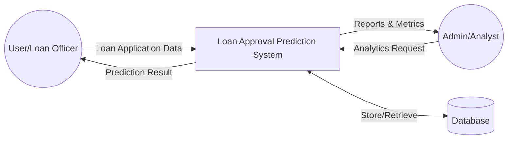
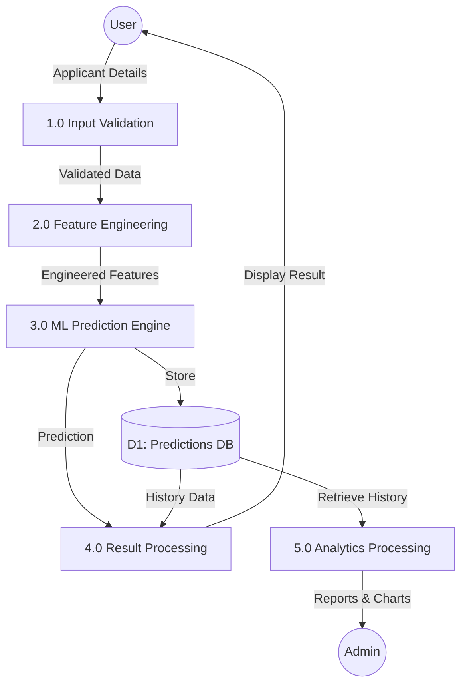
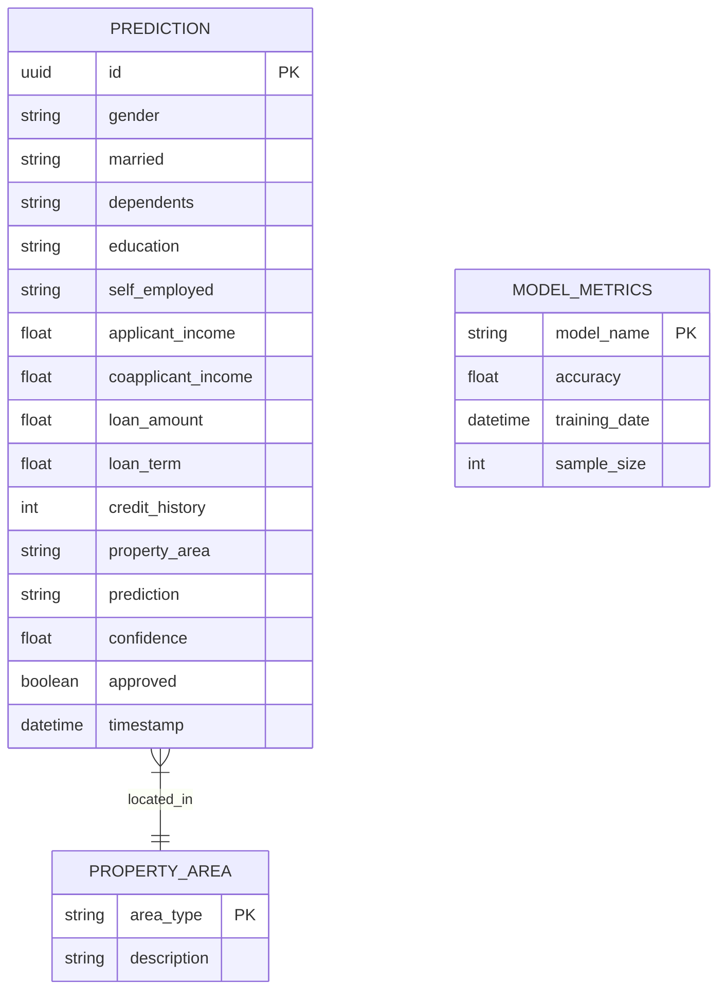
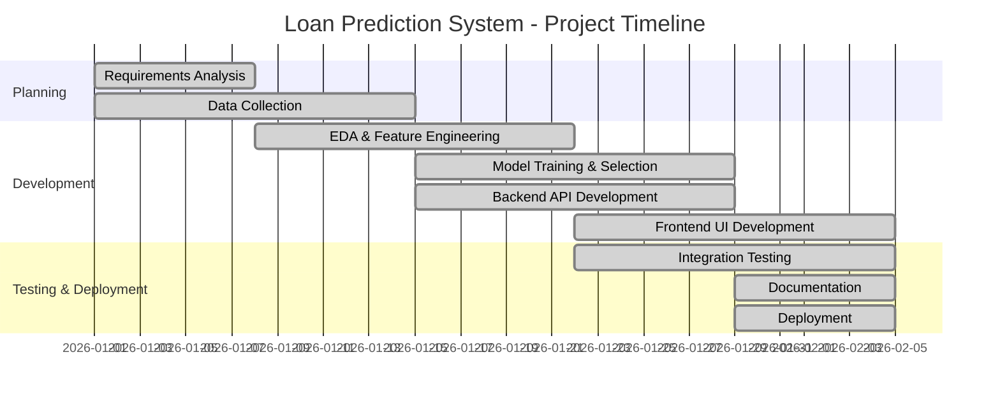
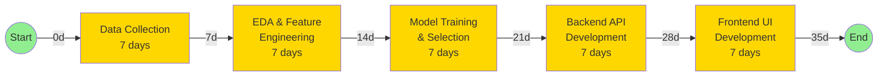
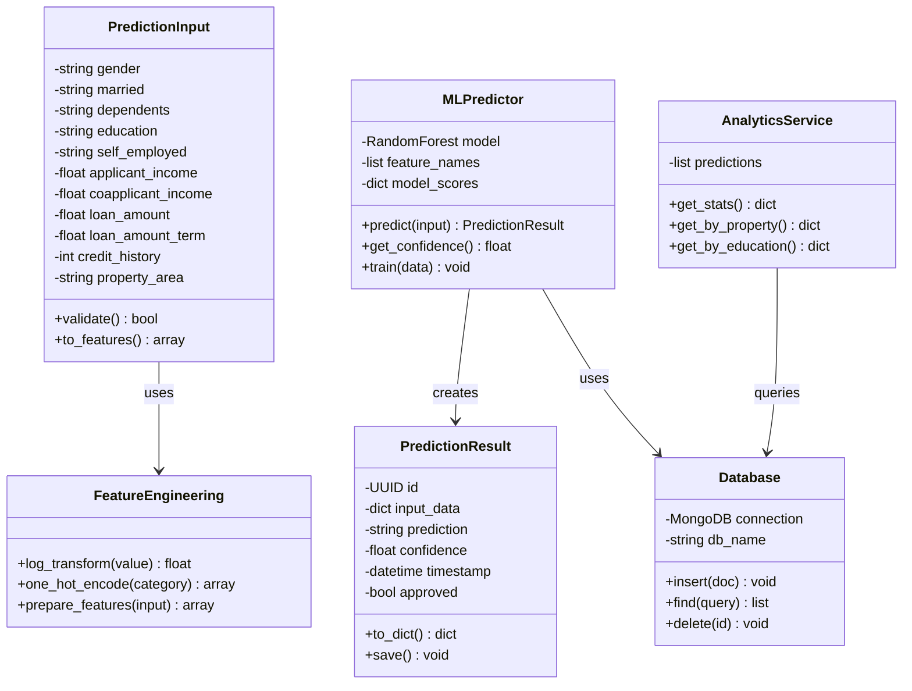
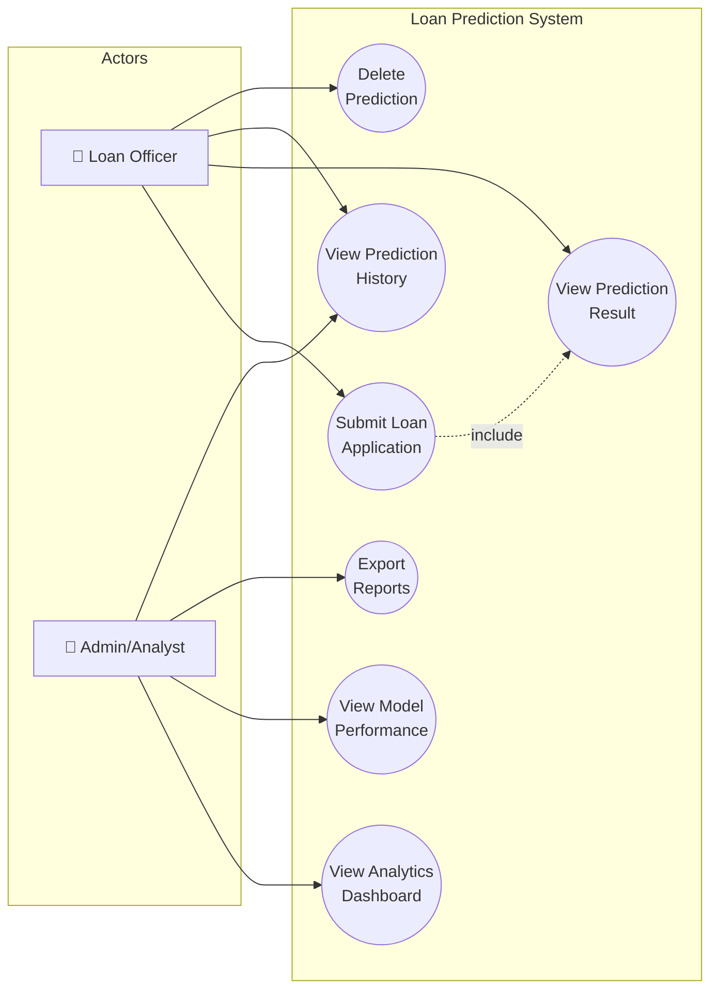
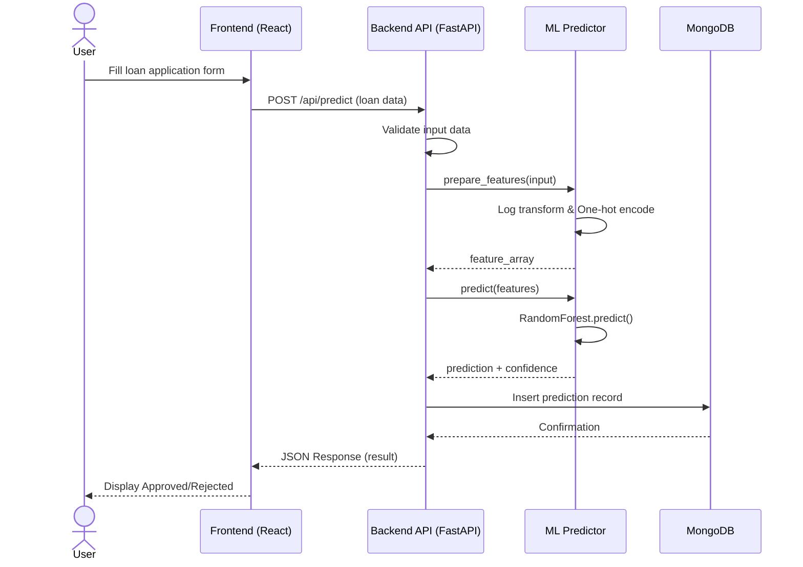
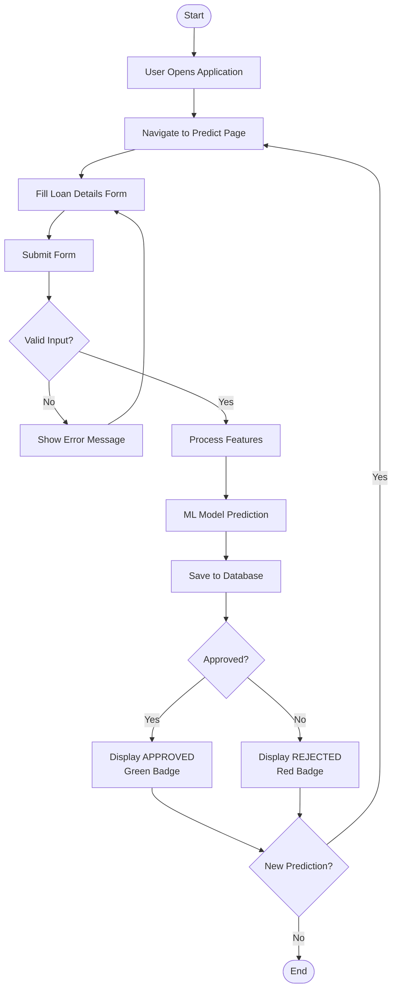

# Loan Approval Prediction System - Project Diagrams

## 1. DFD Level 0 (Context Diagram)

```
┌─────────────────────────────────────────────────────────────────┐
│                                                                 │
│    ┌──────────┐         Loan Application Data          ┌──────────────────┐
│    │          │ ─────────────────────────────────────► │                  │
│    │   User   │                                        │   Loan Approval  │
│    │  (Loan   │                                        │    Prediction    │
│    │ Officer) │ ◄───────────────────────────────────── │      System      │
│    │          │      Prediction Result (Approved/      │                  │
│    └──────────┘           Rejected + Confidence)       └──────────────────┘
│                                                                 │
│                                                                 │
│    ┌──────────┐         Analytics Request              ┌──────────────────┐
│    │          │ ─────────────────────────────────────► │                  │
│    │  Admin/  │                                        │   Loan Approval  │
│    │ Analyst  │ ◄───────────────────────────────────── │    Prediction    │
│    │          │      Reports, Charts, Model Metrics    │      System      │
│    └──────────┘                                        └──────────────────┘
│                                                                 │
└─────────────────────────────────────────────────────────────────┘
```

### DFD Level 0 - Mermaid Version


---

## 2. DFD Level 1 (Detailed Data Flow)

```
┌────────────────────────────────────────────────────────────────────────────────┐
│                                                                                │
│  ┌────────┐                                                                    │
│  │  User  │                                                                    │
│  └───┬────┘                                                                    │
│      │                                                                         │
│      │ Applicant Details                                                       │
│      ▼                                                                         │
│  ┌─────────────────┐      Processed Data     ┌─────────────────┐              │
│  │  1.0            │ ───────────────────────►│  2.0            │              │
│  │  Input          │                         │  Feature        │              │
│  │  Validation     │                         │  Engineering    │              │
│  └─────────────────┘                         └────────┬────────┘              │
│                                                       │                        │
│                                                       │ Engineered Features    │
│                                                       ▼                        │
│                                              ┌─────────────────┐              │
│  ┌─────────────────┐    Prediction Result    │  3.0            │              │
│  │  4.0            │◄────────────────────────│  ML Prediction  │              │
│  │  Result         │                         │  Engine         │              │
│  │  Processing     │                         └────────┬────────┘              │
│  └────────┬────────┘                                  │                        │
│           │                                           │ Save Prediction        │
│           │ Display Result                            ▼                        │
│           ▼                                  ┌─────────────────┐              │
│      ┌────────┐                              │  D1             │              │
│      │  User  │                              │  Predictions    │              │
│      └────────┘                              │  Database       │              │
│                                              └─────────────────┘              │
│                                                       │                        │
│  ┌────────┐          Analytics Data                   │                        │
│  │ Admin  │◄──────────────────────────────────────────┘                        │
│  └────────┘                                                                    │
│                                                                                │
└────────────────────────────────────────────────────────────────────────────────┘
```

### DFD Level 1 - Mermaid Version


---

## 3. ER Diagram (Entity Relationship)

```
┌─────────────────────────────────────────────────────────────────────────┐
│                                                                         │
│  ┌─────────────────────┐         ┌─────────────────────┐               │
│  │     PREDICTION      │         │    MODEL_METRICS    │               │
│  ├─────────────────────┤         ├─────────────────────┤               │
│  │ PK  id (UUID)       │         │ PK  model_name      │               │
│  │     gender          │         │     accuracy        │               │
│  │     married         │         │     training_date   │               │
│  │     dependents      │         │     sample_size     │               │
│  │     education       │         └─────────────────────┘               │
│  │     self_employed   │                                               │
│  │     applicant_income│         ┌─────────────────────┐               │
│  │     coapplicant_inc │         │   PROPERTY_AREA     │               │
│  │     loan_amount     │         ├─────────────────────┤               │
│  │     loan_term       │         │ PK  area_type       │               │
│  │     credit_history  │         │     description     │               │
│  │ FK  property_area   │─────────│                     │               │
│  │     prediction      │         └─────────────────────┘               │
│  │     confidence      │                                               │
│  │     approved (bool) │         ┌─────────────────────┐               │
│  │     timestamp       │         │    EDUCATION_TYPE   │               │
│  └─────────────────────┘         ├─────────────────────┤               │
│                                  │ PK  education_type  │               │
│                                  │     description     │               │
│                                  └─────────────────────┘               │
│                                                                         │
└─────────────────────────────────────────────────────────────────────────┘
```

### ER Diagram - Mermaid Version


---

## 4. Gantt Chart (Project Timeline)

```
┌──────────────────────────────────────────────────────────────────────────────────┐
│                    LOAN PREDICTION SYSTEM - PROJECT TIMELINE                      │
├──────────────────────────────────────────────────────────────────────────────────┤
│ Task                          │ Week 1 │ Week 2 │ Week 3 │ Week 4 │ Week 5 │     │
├───────────────────────────────┼────────┼────────┼────────┼────────┼────────┤     │
│ Requirements Analysis         │████████│        │        │        │        │     │
│ Data Collection & Cleaning    │████████│████████│        │        │        │     │
│ EDA & Feature Engineering     │        │████████│████████│        │        │     │
│ Model Training & Selection    │        │        │████████│████████│        │     │
│ Backend API Development       │        │        │████████│████████│        │     │
│ Frontend UI Development       │        │        │        │████████│████████│     │
│ Integration & Testing         │        │        │        │████████│████████│     │
│ Documentation                 │        │        │        │        │████████│     │
│ Deployment                    │        │        │        │        │████████│     │
└──────────────────────────────────────────────────────────────────────────────────┘
```

### Gantt Chart - Mermaid Version


---

## 5. PERT Chart (Program Evaluation and Review Technique)

```
┌────────────────────────────────────────────────────────────────────────────────────┐
│                              PERT CHART                                            │
│                                                                                    │
│    ┌───┐      ┌───┐      ┌───┐      ┌───┐      ┌───┐      ┌───┐      ┌───┐       │
│    │ 1 │─────►│ 2 │─────►│ 3 │─────►│ 4 │─────►│ 5 │─────►│ 6 │─────►│ 7 │       │
│    └───┘      └───┘      └───┘      └───┘      └───┘      └───┘      └───┘       │
│   START       Data        EDA       Model     Backend    Frontend    END         │
│              Collect    Analysis   Training     API         UI                    │
│                │                      │          │                                │
│                │          3d          │    7d    │    7d                          │
│                └──────────────────────┴──────────┴────────────────────────────    │
│                                                                                    │
│    Critical Path: 1 → 2 → 3 → 4 → 5 → 6 → 7                                       │
│    Total Duration: 35 days                                                         │
│                                                                                    │
│    Node Details:                                                                   │
│    ┌─────┬────────────────────────┬──────────┬──────────┐                         │
│    │Node │ Activity               │ Duration │ Slack    │                         │
│    ├─────┼────────────────────────┼──────────┼──────────┤                         │
│    │  1  │ Project Start          │    0d    │    0     │                         │
│    │  2  │ Data Collection        │    7d    │    0     │                         │
│    │  3  │ EDA & Feature Eng.     │    7d    │    0     │                         │
│    │  4  │ Model Training         │    7d    │    0     │                         │
│    │  5  │ Backend Development    │    7d    │    0     │                         │
│    │  6  │ Frontend Development   │    7d    │    0     │                         │
│    │  7  │ Project End            │    0d    │    0     │                         │
│    └─────┴────────────────────────┴──────────┴──────────┘                         │
│                                                                                    │
└────────────────────────────────────────────────────────────────────────────────────┘
```

### PERT Chart - Mermaid Version


---

## 6. Class Diagram

```
┌─────────────────────────────────────────────────────────────────────────────────┐
│                              CLASS DIAGRAM                                       │
│                                                                                  │
│  ┌──────────────────────────┐       ┌──────────────────────────┐               │
│  │    PredictionInput       │       │    PredictionResult      │               │
│  ├──────────────────────────┤       ├──────────────────────────┤               │
│  │ - gender: str            │       │ - id: UUID               │               │
│  │ - married: str           │       │ - input_data: dict       │               │
│  │ - dependents: str        │       │ - prediction: str        │               │
│  │ - education: str         │       │ - confidence: float      │               │
│  │ - self_employed: str     │       │ - timestamp: datetime    │               │
│  │ - applicant_income: float│       │ - approved: bool         │               │
│  │ - coapplicant_income:float       ├──────────────────────────┤               │
│  │ - loan_amount: float     │       │ + to_dict(): dict        │               │
│  │ - loan_amount_term: float│       │ + save(): void           │               │
│  │ - credit_history: int    │       └──────────────────────────┘               │
│  │ - property_area: str     │                    ▲                              │
│  ├──────────────────────────┤                    │ creates                      │
│  │ + validate(): bool       │                    │                              │
│  │ + to_features(): array   │       ┌──────────────────────────┐               │
│  └──────────────────────────┘       │    MLPredictor           │               │
│               │                      ├──────────────────────────┤               │
│               │ uses                 │ - model: RandomForest    │               │
│               ▼                      │ - feature_names: list    │               │
│  ┌──────────────────────────┐       │ - model_scores: dict     │               │
│  │   FeatureEngineering     │       ├──────────────────────────┤               │
│  ├──────────────────────────┤       │ + predict(input): Result │               │
│  │ - log_transform(): float │       │ + get_confidence(): float│               │
│  │ - one_hot_encode(): array│       │ + train(data): void      │               │
│  │ + prepare_features():arr │       └──────────────────────────┘               │
│  └──────────────────────────┘                    │                              │
│                                                  │ uses                         │
│  ┌──────────────────────────┐                    ▼                              │
│  │    AnalyticsService      │       ┌──────────────────────────┐               │
│  ├──────────────────────────┤       │      Database            │               │
│  │ - predictions: list      │       ├──────────────────────────┤               │
│  ├──────────────────────────┤       │ - connection: MongoDB    │               │
│  │ + get_stats(): dict      │◄──────│ - db_name: str           │               │
│  │ + get_by_property(): dict│       ├──────────────────────────┤               │
│  │ + get_by_education():dict│       │ + insert(doc): void      │               │
│  └──────────────────────────┘       │ + find(query): list      │               │
│                                     │ + delete(id): void       │               │
│                                     └──────────────────────────┘               │
│                                                                                  │
└─────────────────────────────────────────────────────────────────────────────────┘
```

### Class Diagram - Mermaid Version


---

## 7. Use Case Diagram

```
┌─────────────────────────────────────────────────────────────────────────────────┐
│                              USE CASE DIAGRAM                                    │
│                                                                                  │
│                    ┌─────────────────────────────────────┐                      │
│                    │     Loan Prediction System          │                      │
│                    │                                     │                      │
│    ┌─────┐         │    ┌─────────────────────┐         │                      │
│    │     │         │    │  Submit Loan        │         │                      │
│    │     │─────────┼───►│  Application        │         │                      │
│    │     │         │    └─────────────────────┘         │                      │
│    │     │         │              │                      │                      │
│    │     │         │              │ «include»            │                      │
│    │     │         │              ▼                      │                      │
│    │ L   │         │    ┌─────────────────────┐         │                      │
│    │ o   │         │    │  View Prediction    │         │                      │
│    │ a   │─────────┼───►│  Result             │         │                      │
│    │ n   │         │    └─────────────────────┘         │                      │
│    │     │         │                                     │                      │
│    │ O   │         │    ┌─────────────────────┐         │                      │
│    │ f   │─────────┼───►│  View Prediction    │         │                      │
│    │ f   │         │    │  History            │         │                      │
│    │ i   │         │    └─────────────────────┘         │                      │
│    │ c   │         │                                     │                      │
│    │ e   │         │    ┌─────────────────────┐         │                      │
│    │ r   │─────────┼───►│  Delete Prediction  │         │                      │
│    │     │         │    └─────────────────────┘         │                      │
│    └─────┘         │                                     │         ┌─────┐     │
│                    │    ┌─────────────────────┐         │         │     │     │
│                    │    │  View Analytics     │◄────────┼─────────│     │     │
│                    │    │  Dashboard          │         │         │  A  │     │
│                    │    └─────────────────────┘         │         │  d  │     │
│                    │                                     │         │  m  │     │
│                    │    ┌─────────────────────┐         │         │  i  │     │
│                    │    │  View Model         │◄────────┼─────────│  n  │     │
│                    │    │  Performance        │         │         │     │     │
│                    │    └─────────────────────┘         │         │     │     │
│                    │                                     │         │     │     │
│                    │    ┌─────────────────────┐         │         │     │     │
│                    │    │  Export Reports     │◄────────┼─────────│     │     │
│                    │    └─────────────────────┘         │         └─────┘     │
│                    │                                     │                      │
│                    └─────────────────────────────────────┘                      │
│                                                                                  │
└─────────────────────────────────────────────────────────────────────────────────┘
```

### Use Case Diagram - Mermaid Version


---

## 8. Sequence Diagram

```
┌─────────────────────────────────────────────────────────────────────────────────────┐
│                           SEQUENCE DIAGRAM - Loan Prediction Flow                    │
│                                                                                      │
│   User          Frontend         Backend API        ML Model        Database         │
│    │               │                 │                 │               │             │
│    │  Fill Form    │                 │                 │               │             │
│    │──────────────►│                 │                 │               │             │
│    │               │                 │                 │               │             │
│    │               │  POST /predict  │                 │               │             │
│    │               │────────────────►│                 │               │             │
│    │               │                 │                 │               │             │
│    │               │                 │  Validate Input │               │             │
│    │               │                 │────────┐        │               │             │
│    │               │                 │        │        │               │             │
│    │               │                 │◄───────┘        │               │             │
│    │               │                 │                 │               │             │
│    │               │                 │ prepare_features│               │             │
│    │               │                 │────────────────►│               │             │
│    │               │                 │                 │               │             │
│    │               │                 │                 │  Transform    │             │
│    │               │                 │                 │───────┐       │             │
│    │               │                 │                 │       │       │             │
│    │               │                 │                 │◄──────┘       │             │
│    │               │                 │                 │               │             │
│    │               │                 │     predict()   │               │             │
│    │               │                 │────────────────►│               │             │
│    │               │                 │                 │               │             │
│    │               │                 │  prediction +   │               │             │
│    │               │                 │  confidence     │               │             │
│    │               │                 │◄────────────────│               │             │
│    │               │                 │                 │               │             │
│    │               │                 │            save_prediction      │             │
│    │               │                 │────────────────────────────────►│             │
│    │               │                 │                 │               │             │
│    │               │                 │                 │    saved      │             │
│    │               │                 │◄────────────────────────────────│             │
│    │               │                 │                 │               │             │
│    │               │  JSON Response  │                 │               │             │
│    │               │◄────────────────│                 │               │             │
│    │               │                 │                 │               │             │
│    │ Display Result│                 │                 │               │             │
│    │◄──────────────│                 │                 │               │             │
│    │               │                 │                 │               │             │
└─────────────────────────────────────────────────────────────────────────────────────┘
```

### Sequence Diagram - Mermaid Version


---

## 9. Activity Diagram

```
┌─────────────────────────────────────────────────────────────────────────────────┐
│                              ACTIVITY DIAGRAM                                    │
│                                                                                  │
│                              ┌───────┐                                          │
│                              │ Start │                                          │
│                              └───┬───┘                                          │
│                                  │                                               │
│                                  ▼                                               │
│                         ┌───────────────┐                                       │
│                         │  User Opens   │                                       │
│                         │  Application  │                                       │
│                         └───────┬───────┘                                       │
│                                 │                                                │
│                                 ▼                                                │
│                         ┌───────────────┐                                       │
│                         │ Navigate to   │                                       │
│                         │ Predict Page  │                                       │
│                         └───────┬───────┘                                       │
│                                 │                                                │
│                                 ▼                                                │
│                         ┌───────────────┐                                       │
│                         │  Fill Loan    │                                       │
│                         │  Details Form │                                       │
│                         └───────┬───────┘                                       │
│                                 │                                                │
│                                 ▼                                                │
│                         ┌───────────────┐                                       │
│                         │ Submit Form   │                                       │
│                         └───────┬───────┘                                       │
│                                 │                                                │
│                                 ▼                                                │
│                        ◆───────────────◆                                        │
│                       ╱  Valid Input?   ╲                                       │
│                      ╱                   ╲                                      │
│                     ◆                     ◆                                     │
│                    Yes                    No                                    │
│                     │                      │                                    │
│                     ▼                      ▼                                    │
│            ┌───────────────┐      ┌───────────────┐                            │
│            │   Process     │      │ Show Error    │                            │
│            │   Features    │      │ Message       │                            │
│            └───────┬───────┘      └───────┬───────┘                            │
│                    │                      │                                     │
│                    ▼                      │                                     │
│            ┌───────────────┐              │                                     │
│            │  ML Model     │              │                                     │
│            │  Prediction   │              │                                     │
│            └───────┬───────┘              │                                     │
│                    │                      │                                     │
│                    ▼                      │                                     │
│            ┌───────────────┐              │                                     │
│            │ Save to DB    │              │                                     │
│            └───────┬───────┘              │                                     │
│                    │                      │                                     │
│                    ▼                      │                                     │
│           ◆───────────────◆              │                                     │
│          ╱   Approved?     ╲             │                                     │
│         ╱                   ╲            │                                     │
│        ◆                     ◆           │                                     │
│       Yes                    No          │                                     │
│        │                      │          │                                     │
│        ▼                      ▼          │                                     │
│ ┌─────────────┐      ┌─────────────┐     │                                     │
│ │Display      │      │Display      │     │                                     │
│ │APPROVED     │      │REJECTED     │     │                                     │
│ │(Green)      │      │(Red)        │     │                                     │
│ └──────┬──────┘      └──────┬──────┘     │                                     │
│        │                    │            │                                     │
│        └────────┬───────────┘            │                                     │
│                 │                        │                                     │
│                 ▼◄───────────────────────┘                                     │
│          ┌───────────────┐                                                      │
│          │  End / New    │                                                      │
│          │  Prediction?  │                                                      │
│          └───────────────┘                                                      │
│                                                                                  │
└─────────────────────────────────────────────────────────────────────────────────┘
```

### Activity Diagram - Mermaid Version


---

## 10. Block Diagram

```
┌─────────────────────────────────────────────────────────────────────────────────────┐
│                              SYSTEM BLOCK DIAGRAM                                    │
│                                                                                      │
│  ┌─────────────────────────────────────────────────────────────────────────────┐   │
│  │                              FRONTEND (React)                                │   │
│  │  ┌──────────────┐ ┌──────────────┐ ┌──────────────┐ ┌──────────────┐       │   │
│  │  │  Dashboard   │ │  Prediction  │ │   History    │ │  Analytics   │       │   │
│  │  │    Page      │ │    Form      │ │    Page      │ │    Page      │       │   │
│  │  └──────────────┘ └──────────────┘ └──────────────┘ └──────────────┘       │   │
│  │                                                                              │   │
│  │  ┌──────────────────────────────────────────────────────────────────────┐   │   │
│  │  │                         UI Components (Shadcn)                        │   │   │
│  │  │    Cards  │  Forms  │  Tables  │  Charts (Recharts)  │  Buttons      │   │   │
│  │  └──────────────────────────────────────────────────────────────────────┘   │   │
│  └─────────────────────────────────────────────────────────────────────────────┘   │
│                                       │                                             │
│                                       │ HTTP/REST API                               │
│                                       ▼                                             │
│  ┌─────────────────────────────────────────────────────────────────────────────┐   │
│  │                              BACKEND (FastAPI)                               │   │
│  │                                                                              │   │
│  │  ┌────────────────┐    ┌────────────────┐    ┌────────────────┐            │   │
│  │  │  API Routes    │    │  Feature       │    │   ML Models    │            │   │
│  │  │  /api/predict  │───►│  Engineering   │───►│  RandomForest  │            │   │
│  │  │  /api/history  │    │  Module        │    │  Logistic Reg  │            │   │
│  │  │  /api/analytics│    │                │    │  DecisionTree  │            │   │
│  │  │  /api/metrics  │    │  - Log Trans   │    │  GradBoost     │            │   │
│  │  └────────────────┘    │  - One-Hot     │    └────────────────┘            │   │
│  │                        └────────────────┘                                    │   │
│  └─────────────────────────────────────────────────────────────────────────────┘   │
│                                       │                                             │
│                                       │ PyMongo Driver                              │
│                                       ▼                                             │
│  ┌─────────────────────────────────────────────────────────────────────────────┐   │
│  │                              DATABASE (MongoDB)                              │   │
│  │                                                                              │   │
│  │  ┌────────────────┐    ┌────────────────┐                                   │   │
│  │  │  predictions   │    │  model_metrics │                                   │   │
│  │  │  collection    │    │  collection    │                                   │   │
│  │  └────────────────┘    └────────────────┘                                   │   │
│  │                                                                              │   │
│  └─────────────────────────────────────────────────────────────────────────────┘   │
│                                                                                      │
└─────────────────────────────────────────────────────────────────────────────────────┘
```

---

## 11. System Architecture Diagram

```
┌──────────────────────────────────────────────────────────────────────────────────────┐
│                         SYSTEM ARCHITECTURE DIAGRAM                                   │
│                                                                                       │
│   ┌─────────────────────────────────────────────────────────────────────────────┐   │
│   │                            CLIENT LAYER                                      │   │
│   │                                                                              │   │
│   │    ┌──────────────┐    ┌──────────────┐    ┌──────────────┐                │   │
│   │    │   Desktop    │    │   Mobile     │    │   Tablet     │                │   │
│   │    │   Browser    │    │   Browser    │    │   Browser    │                │   │
│   │    └──────────────┘    └──────────────┘    └──────────────┘                │   │
│   │                                                                              │   │
│   └─────────────────────────────────────────────────────────────────────────────┘   │
│                                       │                                              │
│                                       │ HTTPS                                        │
│                                       ▼                                              │
│   ┌─────────────────────────────────────────────────────────────────────────────┐   │
│   │                         PRESENTATION LAYER                                   │   │
│   │                                                                              │   │
│   │   ┌─────────────────────────────────────────────────────────────────────┐   │   │
│   │   │                    React.js Frontend (Port 3000)                     │   │   │
│   │   │                                                                      │   │   │
│   │   │  ┌─────────┐  ┌─────────┐  ┌─────────┐  ┌─────────┐  ┌─────────┐  │   │   │
│   │   │  │Dashboard│  │ Predict │  │ History │  │Analytics│  │  Layout │  │   │   │
│   │   │  │  .jsx   │  │  .jsx   │  │  .jsx   │  │  .jsx   │  │  .jsx   │  │   │   │
│   │   │  └─────────┘  └─────────┘  └─────────┘  └─────────┘  └─────────┘  │   │   │
│   │   │                                                                      │   │   │
│   │   │  ┌─────────────────────────────────────────────────────────────┐    │   │   │
│   │   │  │              Shadcn UI Components + Tailwind CSS             │    │   │   │
│   │   │  └─────────────────────────────────────────────────────────────┘    │   │   │
│   │   │                                                                      │   │   │
│   │   │  ┌─────────────────────────────────────────────────────────────┐    │   │   │
│   │   │  │              Recharts (Data Visualization)                   │    │   │   │
│   │   │  └─────────────────────────────────────────────────────────────┘    │   │   │
│   │   │                                                                      │   │   │
│   │   └─────────────────────────────────────────────────────────────────────┘   │   │
│   │                                                                              │   │
│   └─────────────────────────────────────────────────────────────────────────────┘   │
│                                       │                                              │
│                                       │ REST API Calls                               │
│                                       ▼                                              │
│   ┌─────────────────────────────────────────────────────────────────────────────┐   │
│   │                          APPLICATION LAYER                                   │   │
│   │                                                                              │   │
│   │   ┌─────────────────────────────────────────────────────────────────────┐   │   │
│   │   │                   FastAPI Backend (Port 8001)                        │   │   │
│   │   │                                                                      │   │   │
│   │   │   ┌───────────────────┐   ┌───────────────────┐                    │   │   │
│   │   │   │   API Endpoints   │   │   Middleware      │                    │   │   │
│   │   │   │                   │   │                   │                    │   │   │
│   │   │   │  POST /api/predict│   │  - CORS          │                    │   │   │
│   │   │   │  GET /api/predict │   │  - Validation    │                    │   │   │
│   │   │   │  GET /api/stats   │   │  - Logging       │                    │   │   │
│   │   │   │  GET /api/metrics │   │                   │                    │   │   │
│   │   │   │  GET /api/analytics   │                   │                    │   │   │
│   │   │   └───────────────────┘   └───────────────────┘                    │   │   │
│   │   │                                                                      │   │   │
│   │   └─────────────────────────────────────────────────────────────────────┘   │   │
│   │                                                                              │   │
│   └─────────────────────────────────────────────────────────────────────────────┘   │
│                                       │                                              │
│                                       │                                              │
│                    ┌──────────────────┴──────────────────┐                          │
│                    │                                      │                          │
│                    ▼                                      ▼                          │
│   ┌────────────────────────────────┐   ┌────────────────────────────────┐           │
│   │      ML/PROCESSING LAYER       │   │        DATA LAYER              │           │
│   │                                │   │                                │           │
│   │  ┌──────────────────────────┐  │   │  ┌──────────────────────────┐  │           │
│   │  │    Scikit-Learn Models   │  │   │  │    MongoDB Database      │  │           │
│   │  │                          │  │   │  │                          │  │           │
│   │  │  ┌────────────────────┐  │  │   │  │  ┌────────────────────┐  │  │           │
│   │  │  │  RandomForest (81%)│  │  │   │  │  │   predictions      │  │  │           │
│   │  │  └────────────────────┘  │  │   │  │  │   collection       │  │  │           │
│   │  │  ┌────────────────────┐  │  │   │  │  └────────────────────┘  │  │           │
│   │  │  │LogisticReg (81.8%) │  │  │   │  │                          │  │           │
│   │  │  └────────────────────┘  │  │   │  │  ┌────────────────────┐  │  │           │
│   │  │  ┌────────────────────┐  │  │   │  │  │   status_checks    │  │  │           │
│   │  │  │DecisionTree (72%)  │  │  │   │  │  │   collection       │  │  │           │
│   │  │  └────────────────────┘  │  │   │  │  └────────────────────┘  │  │           │
│   │  │  ┌────────────────────┐  │  │   │  │                          │  │           │
│   │  │  │GradBoost (80.6%)   │  │  │   │  └──────────────────────────┘  │           │
│   │  │  └────────────────────┘  │  │   │                                │           │
│   │  │                          │  │   │                                │           │
│   │  └──────────────────────────┘  │   └────────────────────────────────┘           │
│   │                                │                                                 │
│   │  ┌──────────────────────────┐  │                                                 │
│   │  │  Feature Engineering     │  │                                                 │
│   │  │  - Log Transformation    │  │                                                 │
│   │  │  - One-Hot Encoding      │  │                                                 │
│   │  └──────────────────────────┘  │                                                 │
│   │                                │                                                 │
│   └────────────────────────────────┘                                                 │
│                                                                                       │
└──────────────────────────────────────────────────────────────────────────────────────┘
```

---

## Technologies Used Summary

| Layer | Technology | Purpose |
|-------|-----------|---------|
| Frontend | React 19 | UI Framework |
| Frontend | Tailwind CSS | Styling |
| Frontend | Shadcn UI | Component Library |
| Frontend | Recharts | Data Visualization |
| Backend | FastAPI | REST API |
| Backend | Python 3.11 | Programming Language |
| ML | Scikit-Learn | Machine Learning Models |
| Database | MongoDB | NoSQL Database |
| ML Models | RandomForest | Primary Prediction (81%) |
| ML Models | LogisticRegression | Alternative (81.8%) |
| ML Models | DecisionTree | Alternative (72%) |
| ML Models | GradientBoosting | Alternative (80.6%) |

---

## How to Render Mermaid Diagrams

1. **GitHub**: Paste in any `.md` file - renders automatically
2. **VS Code**: Install "Markdown Preview Mermaid Support" extension
3. **Online**: Use [mermaid.live](https://mermaid.live/) to render
4. **Export**: Use tools like [mermaid-cli](https://github.com/mermaid-js/mermaid-cli) to export as PNG/SVG
